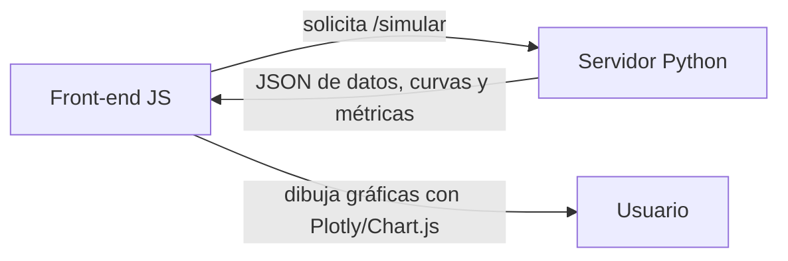
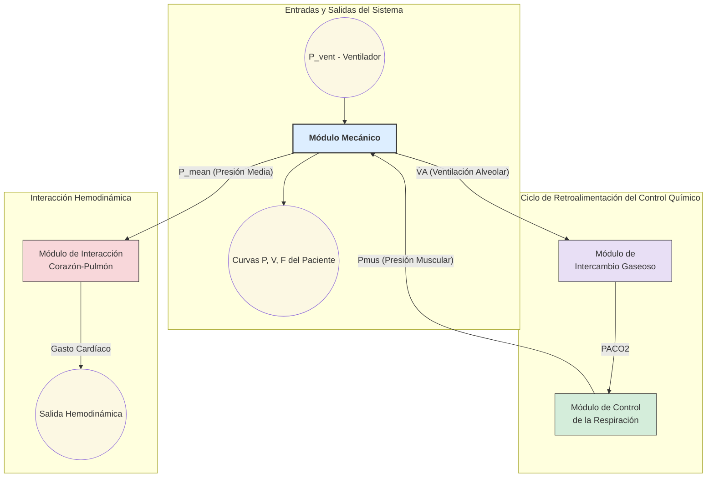

# Simulador de Fisiología Pulmonar

**Versión:** v0.1.0‑mvp  
**Última actualización:** 24 de julio de 2025

## Descripción

Este proyecto es el **MVP** del Simulador de Fisiología Pulmonar, una herramienta interactiva para el aprendizaje de la dinámica respiratoria. Permite a estudiantes y profesionales de la salud ajustar parámetros clínicos y visualizar en tiempo real las curvas de presión y volumen pulmonar.

## Arquitectura y flujo de datos

El flujo de datos es el siguiente:



Dentro del simulador, el flujo de la información es así:




## Características (MVP)

- **Cálculo de simulación**  
  - Clases Python para modelar mecánica pulmonar, intercambio gaseoso, interacción corazón-pulmón y control respiratorio.  
  - Basadas en algoritmos validados con NumPy y SciPy
- **API REST** (`FastAPI`)  
  - Endpoint `POST /simulate` que recibe parámetros y devuelve JSON con arrays de tiempo, presión y volumen
- **Interfaz web** (`React + Bootstrap 5`)  
  - Formulario de entrada de parámetros: compliance, resistencia, frecuencia respiratoria, PEEP, VT, FiO₂  
  - Gráficos 2D interactivos en SVG/Canvas
- **Despliegue en VPS**  
  - Contenedores Docker  
  - Reverse proxy con Nginx y HTTPS (Certbot)
- **Registro y logs**  
  - Logging básico de uso y errores en stdout

## Tecnologías y Herramientas

| Capa        | Herramientas                               |
|-------------|---------------------------------------------|
| **Frontend**  | Node.js, npm, React, Bootstrap 5, Vite, ESLint, Prettier, Jest, React Testing Library |
| **Backend**   | Python 3.10+, FastAPI, Uvicorn, Pydantic, NumPy, SciPy, pytest, black, flake8, Matplotlib (opcional) |
| **DevOps**    | Docker, Docker Compose, Nginx, Certbot (Let’s Encrypt), GitHub Actions CI/CD |

## Instalación y Ejecución Local

1. Clonar el repositorio y posicionarse en la carpeta:
    ```bash
    git clone <https://github.com/julianestebanquintana/simulador_fisiologia_pulmonar>
    cd  simulador_fisiologia_pulmonar
    ```
2. Copiar el archivo de ejemplo de variables (si aplica):
    ```bash
    cp .env.example .env
    ```
3. Construir y levantar los contenedores:
    ```bash
    docker-compose up --build -d
    ```
4. Acceder en el navegador:
    ```
    http://localhost:3000   # Frontend (Vite)
    http://localhost:8000   # Backend (FastAPI docs: /docs)
    ```

## Despliegue en Producción (VPS)

1. En el VPS (Ubuntu 22.04+), instalar Docker y Docker Compose.
2. Clonar el repositorio y configurar variables de entorno:
    ```bash
    git clone <https://github.com/julianestebanquintana/simulador_fisiologia_pulmonar> && cd simulador_fisiologia_pulmonar
    cp .env.production .env
    ```
3. Ajustar `docker-compose.yml` si cambia dominio o puertos.
4. Levantar servicios:
    ```bash
    docker-compose pull --quiet
    docker-compose up -d
    ```
5. Verificar:
    - `https://simulador.midominio.edu`
    - Documentación automática en `https://simulador.midominio.edu/docs`

## Pruebas y Calidad de Código

- **Backend**:
  ```bash
  # Ejecutar tests unitarios
  pytest --maxfail=1 --disable-warnings -q

  # Analizar estilo y formateo
  flake8 && black --check .
  ```

- **Frontend**:
  ```bash
  # Lint y formateo
  npm run lint   # ESLint + Prettier

  # Ejecutar tests
  npm test
  ```

## Estructura de Carpetas

```text
simulador_fisiologia_pulmonar/
├── backend/
│   ├── app/               # Endpoints y lógica de la API (FastAPI)
│   ├── models/            # Módulos del modelo fisiológico
│   │   ├── __init__.py    # Convierte a models en un paquete
│   │   ├── paciente.py    # Clase Paciente
│   │   ├── ventilador.py  # Clase Ventilador
│   │   ├── simulador.py   # Clase orquestadora principal
│   │   ├── intercambio.py # Módulo de intercambio gaseoso
│   │   ├── hemodinamica.py# Módulo de interacción corazón-pulmon
│   │   └── control.py     # Módulo de control respiratorio
│   ├── tests/             # Pruebas para todos los módulos
│   └── Dockerfile
├── frontend/              # Código React
│   ├── src/
│   ├── public/
│   └── Dockerfile
├── docker-compose.yml     # Orquestación de contenedores
├── nginx/                 # Configuración de Nginx y TLS
├── .github/workflows/     # CI/CD (GitHub Actions)
├── README.md              # Documentación del proyecto
└── SRD_Simulador_Fisiologia_Pulmonar.md  # Requisitos de software

```  

## Contribuciones

1. Abrir un *issue* describiendo el cambio o bug.  
2. Crear una *feature branch* (`git checkout -b feature/mi-cambio`).  
3. Hacer *commit* con mensajes claros y firmes.  
4. Abrir *Pull Request* apuntando a `main`.

## Licencia

Este proyecto es académico y se distribuye bajo **licencia MIT**. Consulta el archivo [LICENSE](LICENSE) para más detalles.

---
